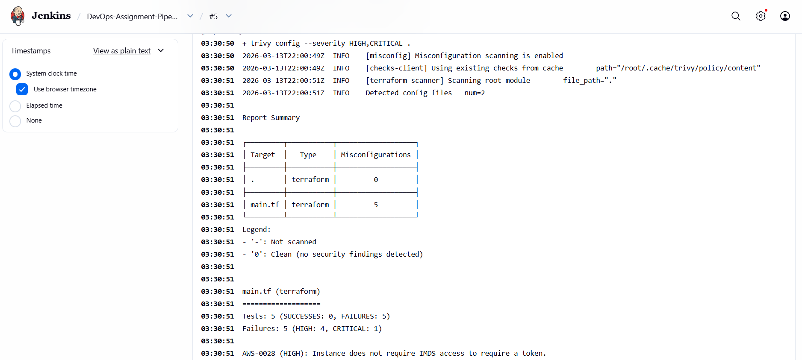
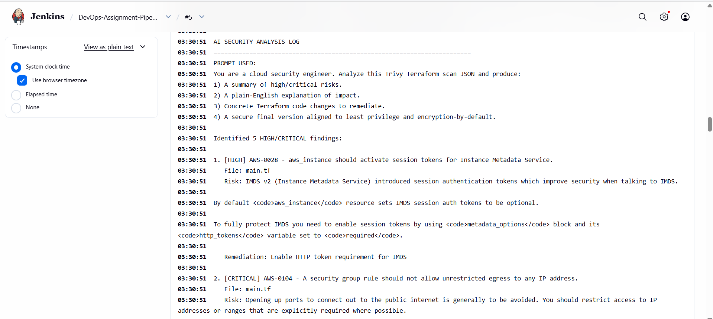
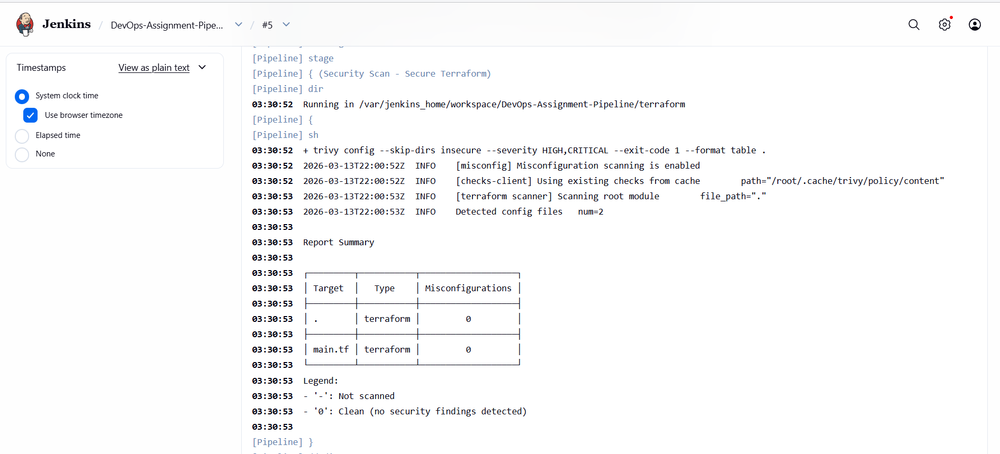
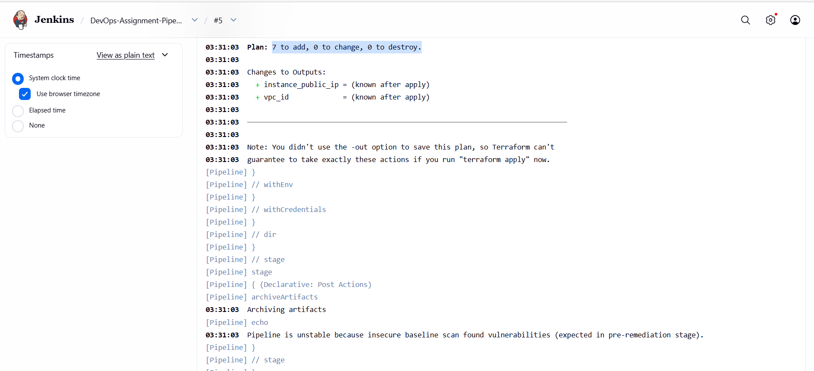
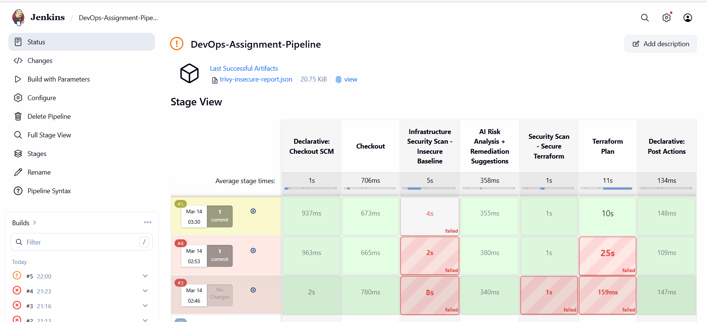
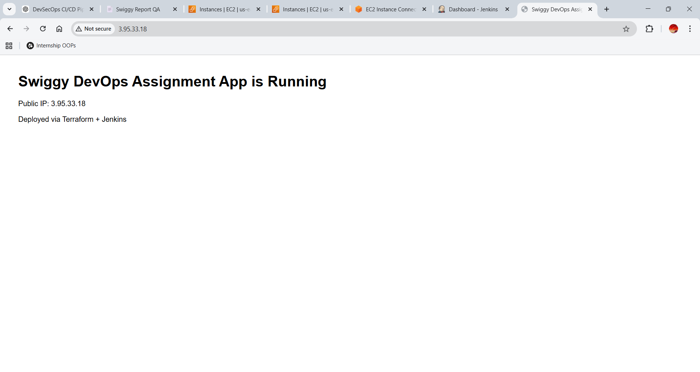

# DevOps Assignment - Secure Infrastructure Pipeline (GET 2026)

This repository demonstrates a complete DevOps workflow for a Python web application:

1. Containerize a web app using Docker.
2. Provision cloud infrastructure using Terraform (AWS).
3. Build a Jenkins CI pipeline that performs infrastructure security scanning using Trivy.
4. Use AI-assisted remediation guidance to fix Terraform security issues.

## Project Overview

The application is a Streamlit-based question-answering app (`app.py`).

For the assignment, the main focus is secure-by-default infrastructure automation:

- `terraform/insecure/main.tf`: intentionally vulnerable IaC baseline (for failing security scan).
- `terraform/main.tf`: secured IaC implementation (for passing security scan).
- `Jenkinsfile`: CI pipeline with scan, AI analysis log, and Terraform plan stage.

## Architecture

```text
Developer Push
   |
   v
Jenkins Pipeline (Docker)
   |
   +--> Stage 1: Checkout source code
   |
   +--> Stage 2A: Trivy scan on insecure Terraform (expected fail/unstable)
   |
   +--> Stage 2B: AI analysis of Trivy report + remediation recommendations
   |
   +--> Stage 2C: Trivy scan on secure Terraform (expected pass)
   |
   +--> Stage 3: Terraform plan (optional, requires AWS credentials)
   |
   v
AWS Infrastructure (VPC + Subnet + SG + EC2)
```

## Cloud Provider Used

- AWS (Terraform AWS Provider)

## Tools and Technologies

- Python, Streamlit
- Docker, Docker Compose
- Jenkins (Pipeline as Code)
- Terraform
- Trivy (IaC misconfiguration scanner)
- AI-assisted security analysis (`scripts/ai_remediate.py`)

## Repository Structure

```text
.
├── Dockerfile
├── docker-compose.yml
├── Jenkinsfile
├── jenkins/
│   ├── Dockerfile
│   └── plugins.txt
├── scripts/
│   └── ai_remediate.py
├── terraform/
│   ├── main.tf              # secure final code
│   ├── variables.tf
│   ├── versions.tf
│   ├── outputs.tf
│   └── insecure/
│       └── main.tf          # intentionally vulnerable code
└── app.py
```

## Requirement Mapping

### 1) Web Application + Docker

Implemented:

- `Dockerfile` for Streamlit app.
- `docker-compose.yml` for app + Jenkins.

Run locally:

```bash
docker compose up --build app
```

App URL: `http://localhost:8501`

### 2) Infrastructure as Code (Terraform)

Provisioned resources:

- VPC
- Public Subnet
- Internet Gateway + Route Table
- Security Group
- EC2 instance (compute)

Intentional vulnerability included in `terraform/insecure/main.tf`:

- SSH (22) open to `0.0.0.0/0`
- Public management port `8080` open to `0.0.0.0/0`
- Unencrypted root volume (`encrypted = false`)

Secured version in `terraform/main.tf`:

- SSH restricted to `allowed_ssh_cidr`
- Public management port removed
- Root volume encryption enabled

### 3) Jenkins Pipeline (CI/CD)

Run Jenkins:

```bash
docker compose up --build jenkins
```

Jenkins URL: `http://localhost:8080`

Pipeline stages in `Jenkinsfile`:

1. Checkout
2. Infrastructure Security Scan - Insecure Baseline (Trivy)
3. AI Risk Analysis + Remediation Suggestions
4. Security Scan - Secure Terraform (Trivy)
5. Terraform Plan (optional, parameter-driven)

### 4) AI-Driven Security Remediation

The AI remediation stage uses `scripts/ai_remediate.py` to:

- Parse Trivy JSON output from insecure scan.
- Summarize HIGH/CRITICAL findings.
- Explain risks in plain language.
- Print remediation recommendations.

After remediation (secure Terraform), pipeline re-scan should pass with no HIGH/CRITICAL issues.

## Before and After Security Report

### Before (Expected Fail/Warnings)

- Source scanned: `terraform/insecure/main.tf`
- Result: HIGH/CRITICAL findings present

### After (Expected Pass)

- Source scanned: `terraform/main.tf`
- Result: zero HIGH/CRITICAL findings

## AI Usage Log (Mandatory)

### Exact AI Prompt Used

```text
You are a cloud security engineer. Analyze this Trivy Terraform scan JSON and produce:
1) A summary of high/critical risks.
2) A plain-English explanation of impact.
3) Concrete Terraform code changes to remediate.
4) A secure final version aligned to least privilege and encryption-by-default.
```

### Summary of Identified Risks

- Internet-exposed SSH (`0.0.0.0/0`) increases brute-force and unauthorized access risk.
- Publicly exposed management port broadens attack surface.
- Unencrypted root volume risks data exposure at rest.

### How AI-Recommended Changes Improved Security

- Implemented least-privilege inbound network rules.
- Removed unnecessary public management access.
- Enforced disk encryption by default.
- Added Terraform variable validation preventing unsafe SSH CIDR default.

## Terraform Commands (Manual)

Secure stack:

```bash
cd terraform
terraform init
terraform validate
terraform plan -var="allowed_ssh_cidr=<YOUR_PUBLIC_IP>/32"
```

## Required Screenshots Checklist

Add these to your submission repository:

1. Jenkins pipeline with initial failing/unstable scan on insecure Terraform.
2. Jenkins console showing Trivy vulnerability report.
3. Jenkins pipeline successful run after secure re-scan.
4. Application running on cloud public IP/domain.

## Evidence Screenshots

Captured in this repository:

1. Insecure Trivy findings (HIGH/CRITICAL):


2. AI remediation analysis log in Jenkins console:


3. Secure Terraform scan pass (0 findings):


4. Terraform plan output:


5. Overall Jenkins pipeline stage view:


6. Application running on cloud public IP/domain:


## Video Recording Checklist (5-10 mins)

Show in sequence:

1. Dockerized app running locally.
2. Jenkins pipeline execution.
3. Trivy insecure findings and AI remediation analysis in console.
4. Secure re-scan pass result.
5. Terraform plan/deployment.
6. Application accessible on cloud public IP/domain.

Add the video link in this README under a section named `Demo Video` before submission.

## Notes

- `RUN_TERRAFORM_PLAN` pipeline parameter is `false` by default because plan requires valid AWS credentials.
- To run plan in Jenkins, configure AWS credentials in Jenkins environment and set `RUN_TERRAFORM_PLAN=true`.
